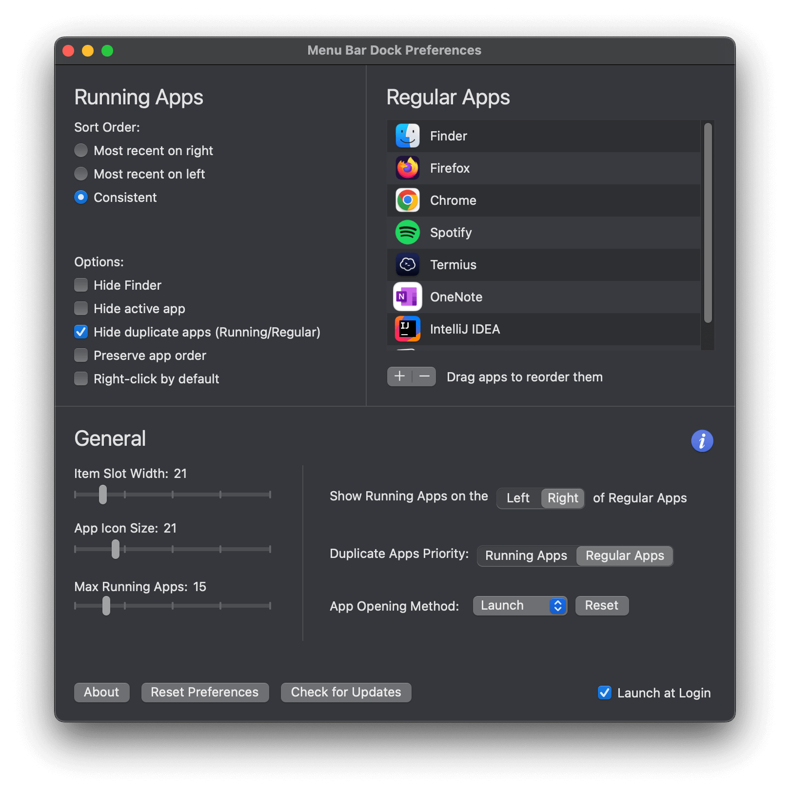

# Menu Bar Dock

 

  

### Menu Bar Dock shows MacOS apps in the menu bar. With a click of the app icon, you can open the app straight from the menu bar.

### Download it [here](https://github.com/EthanSK/Menu-Bar-Dock/releases/latest/download/Menu.Bar.Dock.app.zip)

### Check out our website [here](https://www.menubardock.com/)

**It is highly recommended that you enable automatically hide and show the dock in system preferences**. Now you have freed up all that space at the bottom of the screen where the dock used to always be showing, and you can open apps by clicking their icon in the menu bar at the top!

Menu Bar Dock can work in two ways: running apps and regular apps. To get an experience most similar to the normal dock you're used to, just use regular apps. Do this by going to preferences (right click a menu bar item), add your desired apps to the 'Regular Apps' section, then set the max number of running apps to 0. However, we recommend you give the running apps feature a try, it can be very useful for switching quickly between recently used apps.

#### Reasons to use Menu Bar Dock ...

- **Save screen space** - You don't need the normal dock to show at the bottom of your screen any more. Lots of valuable space saved! While automatically unhiding the dock to go to your app solves the problem of screen space, you must wait until it shows (if it even does show - often it doesn't due to lag), then look for the icon you want, then drag your mouse across the screen to click and open it. Who actually wants that?

- **Laggy computers** - If your computer suffers from lag when your activity gets more heavy and starts causing problems with switching apps, this is the perfect app for you.

- **Save time and increase comfort** - While the Command+Tab shortcut can switch between your open apps in order, it requires one hand always on the keyboard, and can be laggy and take a while to show - by then you could have unhide the dock and found the app you want to click on manually! Time-wasting!

#### Extra info

If you hold command while dragging the icons to place them where you would like on the menu bar. It will reorder automatically once you change apps again.

For more info and tips, press the blue 'i' in the general section of the preferences window of the app.

Open preferences by right clicking an app and then selecting 'Menu Bar Dock Preferences' at the bottom.

Any feedback or queries can be submitted [here](https://github.com/EthanSK/Menu-Bar-Dock/issues)

The number of downloads for this app can be found by running `curl -s https://api.github.com/repos/EthanSK/Menu-Bar-Dock/releases | egrep '"name"|"updated_at"|"download_count"'` in a terminal.

Support this project:
<link href="https://fonts.googleapis.com/css?family=Cookie" rel="stylesheet"><a class="bmc-button" target="_blank" href="https://www.buymeacoffee.com/ETGgames"> Buy me a coffee</a>
